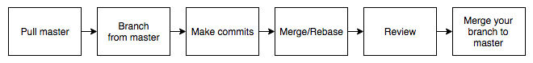

# Human Device Git Guide

## Table of Contents
* [Development flow](#development-flow)
* [Branch naming](#branch-naming)
* [Code review](#code-review)
* [Merge and rebase](#merge-and-rebase)
* [Commit messages](#commit-messages)

### Development flow


### Branch naming
Branches are usually named in following style:
- ticket number
- initials of the programmer
- short summary of the task

Depending on the projects, some of those can be ommited.

Example:
```
17-ap-new-guidelines
```

### Code review
Upon finishing your changes, you should inform everyone and request a code review. Reviewer can be assigned or volounteer if they have no other tickets at the moment. Branch designed for code review should be updated with ``master``, with all conflicts resolved.
During code review you should make sure code is readable and follows [Swift Guidelines](/Style). After review, if the solution got accepted, reviewer should merge reviewed branch into master and delete it afterwards.

### Merge and rebase
While developing on your own branch, you should make sure it's up to date with master. Updates can be handled by ``merge`` or ``rebase`` commands.

Rebase helps keep cleaner history, but it can be used only for local branches that haven't been pushed yet. In other instances, you have to use ``merge`` command.
